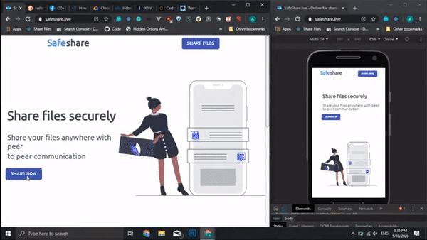

# SafeShare    

## This is the repo for old version of safeshare(https://v1-safeshare.now.sh/
## ⚠ This is not maintained 

## Learn More

### Demo

https://v1-safeshare.now.sh/qrcode

Open the above link and scan the `Qrcode` 

### `How to use`

### `Server Repo`

[The server repo is available here](https://github.com/vj-abishek/facetime-server)

## How to contribute
Issues and PR's are welcome.

## Copyright

Licensed under the [MIT LICENSE](LICENSE)
